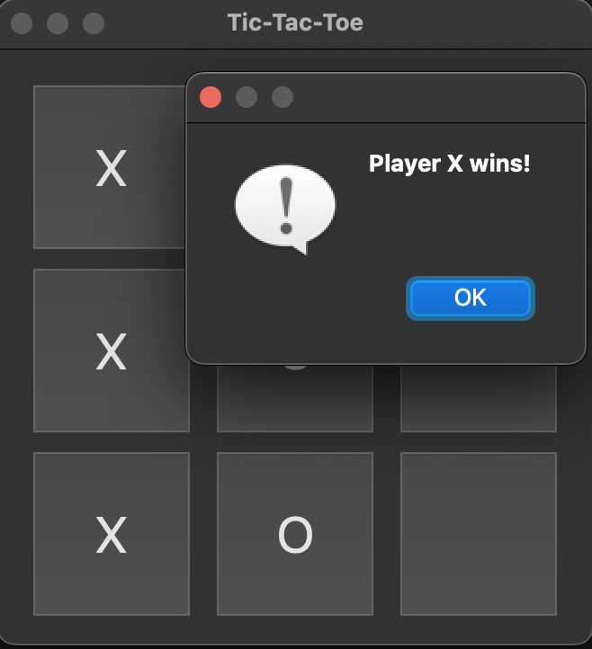

# 🎮 PyQt5 Tic-Tac-Toe

A simple yet fun 2-player Tic-Tac-Toe game built with **PyQt5** for a clean and interactive graphical user interface.

---

## 🖥️ Features

- Beautiful 3x3 game grid with responsive buttons
- 2-player mode (`X` and `O`)
- Win and draw detection with pop-up messages
- Automatically disables the board after game ends

---

## 🚀 Getting Started

### 1. Clone or download this repo

```bash
git clone https://github.com/nyk5073/PyQt5-tictactoe.git
cd PyQt5-tictactoe
```

### 2. Set up a Python virtual environment (recommended)
```
python3.13 -m venv venv
source venv/bin/activate
```

### 3. Install dependencies
```
pip install PyQt5
```

### 4. Run the game
```
python gui_tic_tac_toe_pyqt.py
```

### 5. Deactivate venv when you're done
```
deactivate
```


### 6. 🧪 Running Tests

Make sure you have activated your virtual environment and installed dependencies first. Then run:

```bash
python3 -m unittest test_gui_tictactoe.py -v
```

This will run all unit tests and show detailed output for each test case.

---

# 🧱 File Structure
```
.
├── gui_tic_tac_toe_pyqt.py  
├── tic_tac_toe_pyqt.py      
├── README.md                
└── venv/                    
```


# 📸 Screenshot



# ✅ To Do (Optional Enhancements)
```
 - Add restart button
 - Add AI opponent
 - Add score tracking
 - Convert to executable (.app / .exe)
```